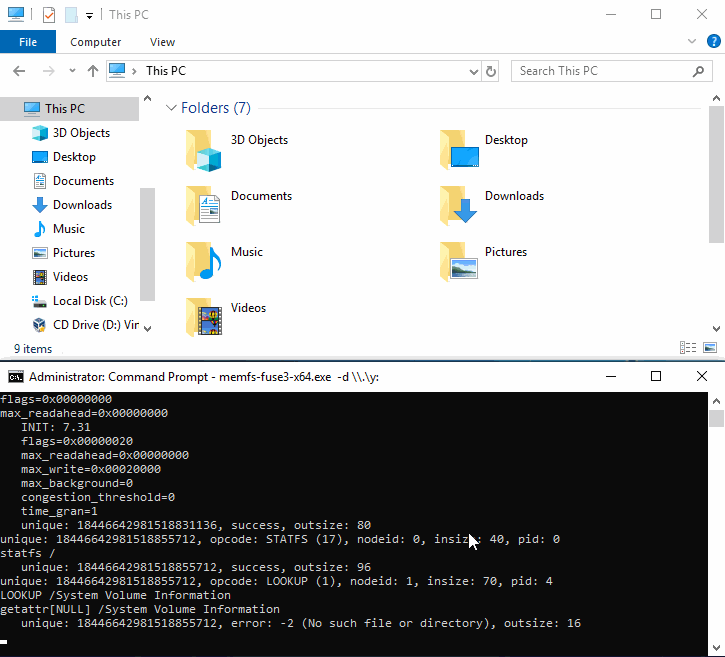
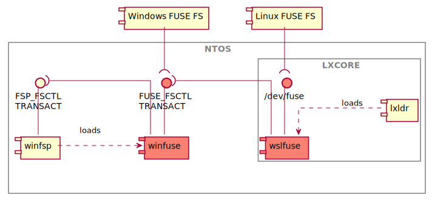
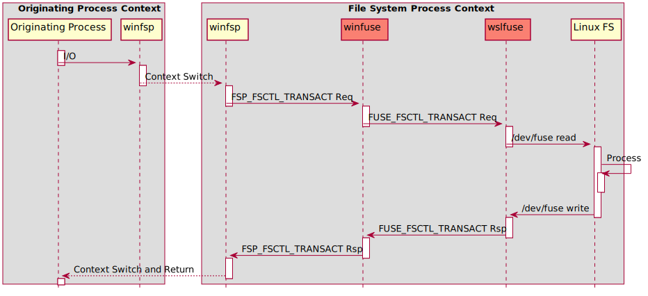

<h1 align="center">
    WinFuse &middot; FUSE for the Windows kernel
</h1>

    <b>Download</b> 
    
     
     
    

WinFuse is a suite of software components that allows FUSE file systems to run on Windows. It consists of a kernel driver that exposes the low-level FUSE protocol and a Windows port of the libfuse library compiled as a DLL.

This is the first release of WinFuse and it should be considered of ALPHA quality. Although I am not aware of any such issues, bugchecks, leaks, system hangs and other system problems are a possibility. For this reason I recommend that you try WinFuse in a VM.

I would really appreciate it if you give WinFuse a try and report any problems. This is especially so if you have a low-level FUSE file system that you cannot easily port to Windows; well now you can. Your feedback is very welcome.

Finally note that this release contains the winfuse kernel driver, which exposes the FUSE protocol in the Windows kernel (via `DeviceIoControl`). It does not contain the wslfuse kernel driver, which will expose the FUSE protocol in WSL1 (via `/dev/fuse`).

    

## Architecture

### Structural Diagram

The following component diagram shows the WinFuse project components and their relations to the Windows OS (NTOS), WSL (LXCORE) and components that are provided by other projects.

The components and their interfaces are:

- The **winfsp** component which is provided by the [WinFsp](https://github.com/billziss-gh/winfsp) project.
    - The component is an NTOS File System Driver (FSD).
    - The component provides an **FSP_FSCTL_TRANSACT** `DeviceIoControl` interface.
    - The component is responsible for loading the **winfuse** component.
- The **winfuse** component which is provided by the WinFuse project (this project).
    - The component is an NTOS driver.
    - The component provides an **FUSE_FSCTL_TRANSACT** `DeviceIoControl` interface.
    - The component connects to the **FSP_FSCTL_TRANSACT** interface. WinFsp file system requests retrieved via this interface are translated to FUSE file system requests and become available via **FUSE_FSCTL_TRANSACT**.
- The **wslfuse** component which is provided by the WinFuse project (this project).
    - The component is an LXCORE driver.
    - The component provides a **/dev/fuse** Linux interface.
    - The component connects to the **FSP_FSCTL_TRANSACT** interface. WinFsp file system requests retrieved via this interface are translated to FUSE file system requests and become available via **/dev/fuse**.
- The **lxldr** component which is provided by the [LxDK](https://github.com/billziss-gh/lxdk) project.
    - The component is an LXCORE driver.
    - The component is responsible for loading the **wslfuse** component.
- The file system (**FS**) components which are user-mode programs provided by third parties.
    - A Windows WinFsp file system connects to the **FSP_FSCTL_TRANSACT** interface.
    - A Windows FUSE file system connects to the **FUSE_FSCTL_TRANSACT** interface.
    - A Linux FUSE file system connects to the **/dev/fuse** interface.

### Behavioral Diagrams

The following sequence diagrams show how the WinFuse project components interact with other components in two scenarios: (1) I/O handled by a Windows FUSE file system, and (2) I/O handled by a Linux FUSE file system.

#### I/O handled by a Windows FUSE file system:

- The I/O originates with one of:
    - A Windows process which uses a familiar API like `ReadFile` or `WriteFile`.
    - A WSL (Linux) process which uses an API like `read(2)` or `write(2)` that LXCORE translates into the equivalent `NtReadFile` or `NtWriteFile`.
- The Windows OS (NTOS) packages this I/O into an IRP (I/O Request Packet) and routes it to the **winfsp** FSD.
- The **winfsp** FSD posts the request into an internal I/O queue. This request is retrieved at a later time and in a different process context via an `FSP_FSCTL_TRANSACT` (issued via `DeviceIoControl`) by the **winfuse** driver.
- The **winfuse** driver translates the request to equivalent FUSE requests, which are then retrieved via an `FUSE_FSCTL_TRANSACT` (issued via `DeviceIoControl`) by the Windows FUSE file system.
- The Windows FUSE file system processes the request and prepares a response, which it sends to the **winfuse** driver via another `FUSE_FSCTL_TRANSACT`.
- The **winfuse** driver processes the FUSE response and it may issue additional FUSE requests or it may translate it to a final WinFsp response, which it sends to the **winfsp** FSD via another `FSP_FSCTL_TRANSACT`.
- The **winfsp** FSD completes the corresponding I/O, which allows the Originating Process to resume and retrieve the response.

#### I/O handled by a Linux FUSE file system:

This case is similar to the previous case except that the **winfuse** driver is replaced by the **wslfuse** driver that exposes the FUSE protocol via the **/dev/fuse** interface that the Linux FUSE file system understands.
